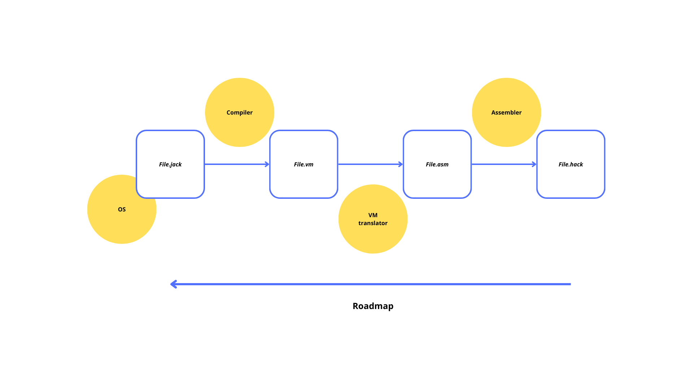

# Build a Modern Computer from First Principles: Nand to Tetris

The Nand2Tetris course is an innovative, hands-on computer science program that takes you on a journey from the most basic logic gate—the NAND gate—to building a complete, working computer system. In the first part, you construct the hardware, developing everything from simple logic circuits to a functioning CPU and memory. In the second part, you build the software stack by creating an assembler, a virtual machine, and even a compiler for a high-level language. This project-based approach demystifies how computers operate by letting you literally build them from scratch, providing deep insights into computer architecture, programming languages, and system design.

## Roadmap

This repo contains: 
- a basic Operating System
- a Compiler
- a Virtual Machine
- an Assembler

All are written in Rust 🦀 and develop in a bottom-up way.